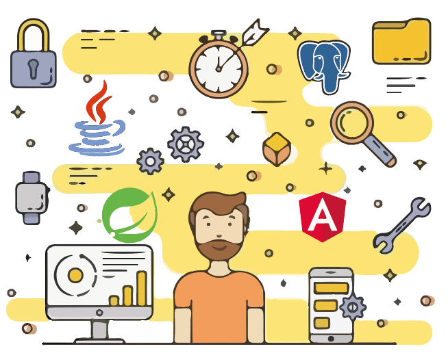

# CURSO FULLSTACK DEVELOPER - MITOCODE

## STACK DEL CURSO

## OBJETIVOS DEL CURSO

* Crear un backend con Spring [Boot]
  * Servicios REST
  * Protección por JWT
  * Spring Data JPA Repository
  * JSON
  * Enfoque Monolítico
  * Enfoque Microservicios
* Crear un frontend con Angular 8
  * Angular Material
  * Seguridad y comunicación con servicios
  * Puesta en producción. despliegue en DigitalOcean

## RECOMENDACIONES DE SOFTWARE

* JDK 1.8 - http://www.oracle.com/technetwork/java/javase/downloads/jdk8-downloads-2133151.html

* Eclipse STS ( IDE )- https://spring.io/tools 

* PostgreSQL 11 (Motor de Base de datos)  https://www.postgresql.org/download/

* pgAdmin IV - (Gestor de PostgreSQL) https://www.pgadmin.org/download/

* Node.js (Versión 10.x LTS) - https://nodejs.org/es/ 

* Visual Studio Code - https://code.visualstudio.com/